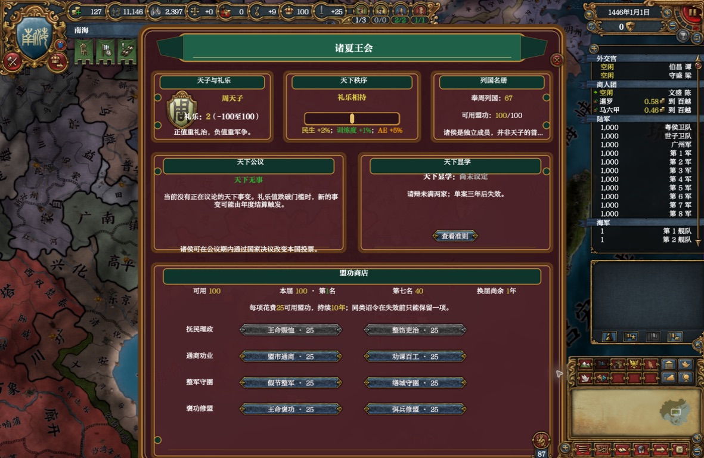
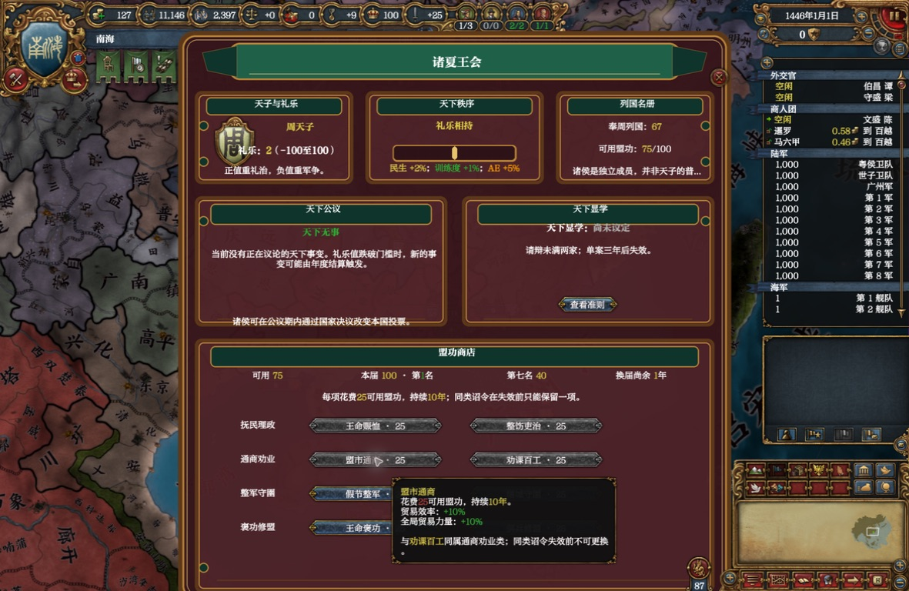
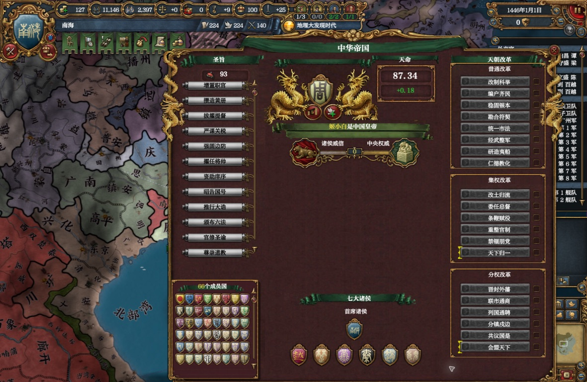

# 盟功商店实机证据（2026-09-01）

> 本组截图形成时，玩家可见标题仍为“盟功商店”，单项价格也仍为旧版的 `25` 盟功。后续已将标题改为“叙功行赏”、增加盟功说明悬停，并把正式价格调整为 `50`；本组图片继续作为布局、扣款链路、同类互斥与改选逻辑的历史实机证据。

## 01_store_ranking.jpeg

完整周天下窗口默认显示在顶栏下方。状态栏显示可用盟功、本届盟功、实时名次、第七名门槛与换届倒计时；八项商品按四类排布，没有重叠、裁切或脚本变量外露。

## 02_purchase_tooltip.jpeg

旧版价格下，购买“盟市通商”后可用盟功由100降至75，同类“劝课百工”同步禁用。悬停仅显示名称、价格、期限、效果与同类限制，不再显示内部国家旗标、变量或脚本效果。当前正式价格为 `50`，余额100时购买后应降至50。

## 03_mandate_reuse.jpeg

二十五年换届结算后，南海位于团队既有天命页“首席诸侯”位置，下方六面盾徽继续使用既有七大诸侯槽位，证明盟功排名没有创建并行名册。

## 日志结论

最终会话的 `error.log` 共1310行，盟功相关筛选结果为零。日志中的地图区域与其他旧内容报错属于既有基线，不在本功能改动范围。
