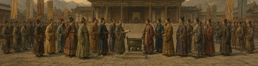
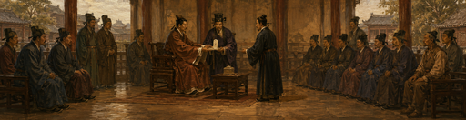

# 模组分类介绍：游戏内文案与配图

生成自 `planning/mod_guide/guide_manifest.json`。各页均可按需阅读；以下为制作预览，不是游戏截图。

## 模组介绍

适用提示：所有国家均可阅读；本册不执行政务操作。 / 所有国家均可阅读。

### 列国入门

- 周室尚存，列国各有社稷；诸子并起，治道各有所归。

### 四篇选读

- **周天下**：共同秩序、外交战争与盟功。
- **朝廷**：爵制晋封、天子与特殊政体。
- **宗教**：礼教、六家践履与宾学。
- **学宫**：地方收益、思想张力与迁徙。

### 随时查阅

- 重开入口：决议栏 → **模组介绍**。
- 所有国家均可阅读；实际行动另有条件。

可选：周天下：列国与盟约；朝廷：爵制与政体；宗教：礼教与百家；学宫：讲席与传承。

返回：无（总目录）；随时合卷。

## 周天下：共守一份盟书

适用提示：本国属于周天下；具体行动仍须满足当时条件。 / 本国不属于周天下；可阅读规则，入列后方享成员权利。

### 列国与共同秩序

- 诸侯各有疆土、军队与政令，共同承认天子、朝会与盟誓。
- **成员身份**不等于附庸关系。
- 各国可以奉行不同的国内国论。

### 三个不同的概念

- **礼乐**：天下秩序的盛衰。
- **盟功**：本国贡献与功劳。
- **天下公议**：处理列国共同议题。

### 查看现状

- 右下方**周天下**入口。
- 后备入口：**打开周天下总览**决议。

可选：成员与礼乐；外交与战争；盟功与七大诸侯；朝会、公议与天下大辩。

返回：模组介绍；随时合卷。

## 谁在周天下之内（1/2）

适用提示：本国属于周天下；具体行动仍须满足当时条件。 / 本国不属于周天下；可阅读规则，入列后方享成员权利。

### 成员身份

- **天子**与登记在册的**诸侯**组成周天下。
- 成员不一定是附庸，共和政体也可入列。
- 版图入口：**查看周天下版图**决议的省份高亮。

### 请列周籍：全部条件

- 入口：天子外交页 → **请列周籍**。
- 本国须为**独立国家**。
- **不与任何周天下国家交战**。
- **没有犯盟、禁入或申请冷却**。
- 本国对天子好感**至少150**。
- 首都位于**中国次大陆**，或**与周天下国家接壤**。

可选：下一页：裁可与复国。

返回：周天下：共守一份盟书；随时合卷。

## 谁在周天下之内（2/2）

适用提示：本国属于周天下；具体行动仍须满足当时条件。 / 本国不属于周天下；可阅读规则，入列后方享成员权利。

### 裁可与复国

- 文化、宗教与政体不限。
- 由天子接受或否决；遭拒后**十年不能再申请**。
- 历史诸侯独立复国，可恢复成员身份。
- **作为附庸被释放，不会自动入列**。

可选：上一页；礼乐怎样影响列国；退出与外交求援。

返回：周天下：共守一份盟书；随时合卷。

## 礼乐：天下共有的盛衰（1/3）

适用提示：本国属于周天下；具体行动仍须满足当时条件。 / 本国不属于周天下；可阅读规则，入列后方享成员权利。

### 礼乐值

- 开局为**0**，范围**-100至100**。
- 政局、朝会、战争与公议都会改变礼乐。
- 入口：**周天下面板**查看现值与当期修正。

### 礼乐至少60

- 税收：**+10%**。
- 生产效率：**+10%**。

### 礼乐20至不足60

- 税收：**+5%**。
- 生产效率：**+5%**。

可选：下一页：礼乐-20至不足20。

返回：周天下：共守一份盟书；随时合卷。

## 礼乐：天下共有的盛衰（2/3）

适用提示：本国属于周天下；具体行动仍须满足当时条件。 / 本国不属于周天下；可阅读规则，入列后方享成员权利。

### 礼乐-20至不足20

- 税收：**+2%**。
- 生产效率：**+2%**。
- 训练度：**+1%**。

### 礼乐-60至不足-20

- 税收：**-5%**。
- 生产效率：**-5%**。
- 训练度：**+2.5%**。
- 省份战争分数花费：**-7.5%**。
- 叛乱度：**+1**。
- 每月荒废：**+0.10**。

可选：下一页：礼乐低于-60；上一页。

返回：周天下：共守一份盟书；随时合卷。

## 礼乐：天下共有的盛衰（3/3）

适用提示：本国属于周天下；具体行动仍须满足当时条件。 / 本国不属于周天下；可阅读规则，入列后方享成员权利。

### 礼乐低于-60

- 税收：**-10%**。
- 生产效率：**-10%**。
- 训练度：**+5%**。
- 省份战争分数花费：**-15%**。
- 叛乱度：**+2**。
- 每月荒废：**+0.15**。

### 战争后果另算

- 侵略扩张不随这五档改变。
- 灭侯的额外侵略扩张与礼乐损失另行计算。

可选：上一页。

返回：周天下：共守一份盟书；随时合卷。

## 战争：核心与犯盟（1/2）

适用提示：本国属于周天下；具体行动仍须满足当时条件。 / 本国不属于周天下；可阅读规则，入列后方享成员权利。

### 何时构成犯盟

- 交战中取得天子或诸侯的省份，且本国**没有该省核心**。
- 普通、永久与任务宣称，均**不能代替核心**。
- 归还核心、释放国家、外交整合等合法转移另行处理。

### 犯盟的后果

- **犯盟**持续约**十年**，再犯刷新期限。
- 天子对责任国好感：**初始-100**。
- 上述关系惩罚每年恢复**10**。
- 天子可取得**奉辞伐罪**战争借口。
- 普通非法割地不额外按发展度追加侵略扩张。
- 原版和约的侵略扩张仍然生效。

可选：下一页：灭侯与责任归属。

返回：周天下：共守一份盟书；随时合卷。

## 战争：核心与犯盟（2/2）

适用提示：本国属于周天下；具体行动仍须满足当时条件。 / 本国不属于周天下；可阅读规则，入列后方享成员权利。

### 灭侯与责任归属

- 每战争灭亡一个成员：额外**固定5侵略扩张**。
- 该额外惩罚施加给其他合格周天下国家。
- 附庸所为，由宗主国承担责任。
- 任何方式灭亡一个成员：天下礼乐**-5**。

可选：上一页；天子犯盟与域外入侵。

返回：周天下：共守一份盟书；随时合卷。

## 退出、告急与救患（1/3）

适用提示：本国属于周天下；具体行动仍须满足当时条件。 / 本国不属于周天下；可阅读规则，入列后方享成员权利。

### 自去周籍：条件与入口

- 入口：**自去周籍**决议。
- 须为**独立诸侯**。
- 本国须**和平**。
- 本国**不能是天子**。

### 退出的代价

- 威望：**-25**。
- 天子对本国：**十年-50好感**。
- 其他成员对本国：**十年-25好感**。
- **二十年内不能申请回归**。
- **清空盟功与本届资格**，不清除已有犯盟。

可选：下一页：告急与救患。

返回：周天下：共守一份盟书；随时合卷。

## 退出、告急与救患（2/3）

适用提示：本国属于周天下；具体行动仍须满足当时条件。 / 本国不属于周天下；可阅读规则，入列后方享成员权利。

### 告急与救患

- **告急**：受域外进攻的独立玩家诸侯向天子请求。
- **救患**：玩家天子在受攻击诸侯外交页主动入援。
- 告急须由天子答复；救患直接参战。
- 两者均**不收资源**。

可选：下一页：入援条件；上一页。

返回：周天下：共守一份盟书；随时合卷。

## 退出、告急与救患（3/3）

适用提示：本国属于周天下；具体行动仍须满足当时条件。 / 本国不属于周天下；可阅读规则，入列后方享成员权利。

### 入援条件

- 天子须**独立**。
- 天子须**和平**。
- 目标须为**独立诸侯**。
- 目标须为**该场防御战争领袖**。
- 须受**域外战争领袖直接进攻**。
- **不能同时卷入周内进攻造成的防御战**。
- 域外进攻方**不能是天子盟友或属国**。

### 入援范围与天子犯盟

- 获准后，天子加入目标的**全部防御战争**。
- 天子本人犯盟，同月一批另扣礼乐**3点**。

可选：上一页。

返回：周天下：共守一份盟书；随时合卷。

## 盟功：三本功簿（1/2）

适用提示：本国属于周天下；具体行动仍须满足当时条件。 / 本国不属于周天下；可阅读规则，入列后方享成员权利。

### 三本功簿

- 入口：周天下面板 → **叙功行赏**。
- **可用盟功**：范围**0至100**，用于请领诏令。
- **本届盟功**：用于席位排名与晋爵资格。
- **终身盟功**：本届同分时，用来比较高下。

### 获得、消费与清理

- 获得盟功通常同时记入三账。
- 消费可用盟功，**不扣本届和终身成绩**。
- 二十五年换届：清空本届成绩和主动贡献资格。
- 退出周天下：**三本账全部清空**。

可选：下一页：两种容易混淆的用途。

返回：周天下：共守一份盟书；随时合卷。

## 盟功：三本功簿（2/2）

适用提示：本国属于周天下；具体行动仍须满足当时条件。 / 本国不属于周天下；可阅读规则，入列后方享成员权利。

### 两种容易混淆的用途

- 晋爵检查**本届盟功**，提交申请**不扣盟功**。
- 请领诏令消耗**可用盟功**。
- 七大诸侯还须**本届至少一次主动贡献**。
- 仅靠发展度取得的基本盟功，不能授予入选资格。

可选：上一页；怎样立功与入选；怎样请领十年诏令。

返回：周天下：共守一份盟书；随时合卷。

## 立功与二十五年改选（1/2）

适用提示：本国属于周天下；具体行动仍须满足当时条件。 / 本国不属于周天下；可阅读规则，入列后方享成员权利。

### 年度基本盟功

- 发展度**不足100**：盟功**+1**。
- 发展度**100至249**：盟功**+2**。
- 发展度**250至499**：盟功**+3**。
- 发展度**至少500**：盟功**+4**。

### 主动贡献

- 作为胜方战争领袖击败域外领袖：**10主动盟功**。
- 普通成员参与大辩投票，结算时得**10主动盟功**。
- 当前显学可能另加评价奖励。

可选：下一页：二十五年改选。

返回：周天下：共守一份盟书；随时合卷。

## 立功与二十五年改选（2/2）

适用提示：本国属于周天下；具体行动仍须满足当时条件。 / 本国不属于周天下；可阅读规则，入列后方享成员权利。

### 二十五年改选

- 资格：现存成员，本届有过**主动贡献**。
- 排名先比**本届盟功**。
- 再比**终身盟功**。
- 仍相同则依次比较**现任七大诸侯身份**、**威望**。
- 前**七名**入席，第**一名**兼任首席。
- 名额可空缺，**任期内不递补**。

### 席位收益与查看入口

- 七大诸侯：力量投射**+10**。
- 首席诸侯：额外力量投射**+10**。
- 花费可用盟功**不影响排名**。
- 成绩及第七名门槛：**周天下功簿**。

可选：上一页。

返回：周天下：共守一份盟书；随时合卷。

## 叙功行赏：把功劳用于治国（1/2）

适用提示：本国属于周天下；具体行动仍须满足当时条件。 / 本国不属于周天下；可阅读规则，入列后方享成员权利。

### 请领诏令

- 入口：周天下面板下半部 → **叙功行赏**。
- 每道诏令消耗**50可用盟功**。
- 诏令持续**十年**。
- 同类仅可持有**一道**，最多同时拥有**四类**。

### 抚民理政：王命赈恤

- 全国叛乱度：**-2**。
- 稳定度花费：**-10%**。

### 抚民理政：整饬吏治

- 每月自治：**-0.05**。
- 每年腐败：**-0.10**。

可选：下一页：通商劝业：盟市通商。

返回：周天下：共守一份盟书；随时合卷。

## 叙功行赏：把功劳用于治国（2/2）

适用提示：本国属于周天下；具体行动仍须满足当时条件。 / 本国不属于周天下；可阅读规则，入列后方享成员权利。

### 通商劝业：盟市通商

- 贸易效率：**+10%**。
- 全局贸易力量：**+10%**。

### 通商劝业：劝课百工

- 建造花费：**-10%**。
- 发展成本：**-5%**。

### 另两类诏令

- **整军守圉**：军队士气与人力，或城防与敌军损耗。
- **褒功修盟**：声誉与威望，或关系与外交官。
- 完整数值：悬停对应诏令按钮。
- 灰色状态会说明**功不足**、**同类占用**或**身份不符**。

可选：上一页。

返回：周天下：共守一份盟书；随时合卷。

## 朝会与天下公议（1/3）

适用提示：本国属于周天下；具体行动仍须满足当时条件。 / 本国不属于周天下；可阅读规则，入列后方享成员权利。

### 召开开封大朝会

- 入口：**召开开封大朝会**决议，限天子。
- 条件：**和平**。
- 条件：稳定度**至少0**。
- 花费：**100金钱**。
- 花费：**50外交点**。
- 结果：礼乐**+10**。
- 冷却：**五年**。

可选：下一页：重申成周盟书。

返回：周天下：共守一份盟书；随时合卷。

## 朝会与天下公议（2/3）

适用提示：本国属于周天下；具体行动仍须满足当时条件。 / 本国不属于周天下；可阅读规则，入列后方享成员权利。

### 重申成周盟书

- 入口：**重申成周盟书**决议，限天子。
- 条件：**和平**。
- 条件：稳定度**至少1**。
- 条件：礼乐**至少50**。
- 花费：**50礼乐**，只可实行**一次**。
- 周天下国家永久外交声誉：**+1**。
- 周天下国家永久叛乱度：**-1**。

可选：下一页：天下公议；上一页。

返回：周天下：共守一份盟书；随时合卷。

## 朝会与天下公议（3/3）

适用提示：本国属于周天下；具体行动仍须满足当时条件。 / 本国不属于周天下；可阅读规则，入列后方享成员权利。

### 天下公议

- 晋封、秩序事变、大辩**不能同时占用议程**。
- 议论通常持续**365日**。
- 各议题的票权与胜出规则不同。
- 大辩的典范加票**不能套用到晋封**。

可选：上一页；天下大辩：怎样上书；爵制与晋封。

返回：周天下：共守一份盟书；随时合卷。

## 天下大辩：先有请辩书（1/2）

适用提示：本国属于周天下；具体行动仍须满足当时条件。 / 本国不属于周天下；可阅读规则，入列后方享成员权利。

### 上书请辩：全部条件

- 入口：**上书请辩**决议。
- 本国须为**周天下礼教国**。
- 本国主学派践履**至少70**。
- 同派至少有**三个周天下礼教国家**。
- 除本国外，另有同派国家践履**至少50**。

### 何时不能请辩

- **广开新论期间不能提出新请辩**。
- **显学十五年任期内不能请辩**。
- **已有天下大辩时不能请辩**。

可选：下一页：请辩书与开辩。

返回：周天下：共守一份盟书；随时合卷。

## 天下大辩：先有请辩书（2/2）

适用提示：本国属于周天下；具体行动仍须满足当时条件。 / 本国不属于周天下；可阅读规则，入列后方享成员权利。

### 请辩书与开辩

- 每派请辩书有效**三年**。
- 只有一份时，不占用公议议程。
- 至少**两份有效请辩**且**公议空闲**，天子才可开辩。
- 恰好两份：直接入席。
- 三份以上：天子择取**两案**。

### 表态与查看

- 其余国家可支持**甲案**、**乙案**或**百家并立**。
- 现行显学与六家名势：**查看天下显学**决议。
- 有效请辩状态：**周天下面板**。

可选：上一页；票权、胜出与显学任期。

返回：周天下：共守一份盟书；随时合卷。

## 大辩结果怎样决定（1/2）

适用提示：本国属于周天下；具体行动仍须满足当时条件。 / 本国不属于周天下；可阅读规则，入列后方享成员权利。

### 票权与期限

- 大辩议论**365日**，各国基础**一票**。
- 典范加票条件：**投给本国主学派**。
- 典范加票条件：投票时践履**至少75**。
- 两项同时满足：票权额外**+1**。
- 票权在投票时固定；之后践履变化不追改。
- 主动改票时，重新核算票权。

### 怎样胜出

- 一家须**同时严格领先另一家与百家并立**。
- 第一名并列：一律**百家并立**。
- 天子**没有破平权**。

可选：下一页：结算奖励。

返回：周天下：共守一份盟书；随时合卷。

## 大辩结果怎样决定（2/2）

适用提示：本国属于周天下；具体行动仍须满足当时条件。 / 本国不属于周天下；可阅读规则，入列后方享成员权利。

### 结算奖励

- 普通成员正式投票：**10主动盟功**。
- 投中胜出显学：额外盟功**+2**。
- 投中胜出的百家并立：额外盟功**+1**。

### 显学任期

- 结果持续**十五年**，期间**不重新请辩**。
- 只调整国际行为的礼乐与盟功评价。
- 不替换国内**主学派**。
- 不改变国内**践履**或**省份宗教**。

可选：上一页；六家国际评价；国内礼教与主学派。

返回：周天下：共守一份盟书；随时合卷。

## 天下显学：同一战事，不同评价（1/4）

适用提示：本国属于周天下；具体行动仍须满足当时条件。 / 本国不属于周天下；可阅读规则，入列后方享成员权利。

### 天下显学的国际评价

- 以下变化只在**显学任期内**生效。
- 年度和平／内战评价，与对外胜利评价分别计算。
- 对外获胜的**10主动盟功**仍另记。

### 儒家显学

- 完全和平：每年额外礼乐**+1**。
- 发生内战：每年额外礼乐**-1**。
- 击败域外领袖：礼乐**+3**。
- 击败域外领袖：额外盟功**+2**。

可选：下一页：法家显学。

返回：周天下：共守一份盟书；随时合卷。

## 天下显学：同一战事，不同评价（2/4）

适用提示：本国属于周天下；具体行动仍须满足当时条件。 / 本国不属于周天下；可阅读规则，入列后方享成员权利。

### 法家显学

- 无内战：每年额外礼乐**+1**。
- 至少三场内战：每年额外礼乐**-2**。
- 击败域外领袖：礼乐**+5**。
- 击败域外领袖：额外盟功**+3**。

### 墨家显学

- 完全和平：每年额外礼乐**+2**。
- 发生内战：每年额外礼乐**-2**。
- 击败域外领袖：礼乐**+1**。
- 击败域外领袖：额外盟功**0**。

可选：下一页：道家显学；上一页。

返回：周天下：共守一份盟书；随时合卷。

## 天下显学：同一战事，不同评价（3/4）

适用提示：本国属于周天下；具体行动仍须满足当时条件。 / 本国不属于周天下；可阅读规则，入列后方享成员权利。

### 道家显学

- 完全和平：每年额外礼乐**+2**。
- 发生内战：每年额外礼乐**-1**。
- 击败域外领袖：礼乐**+1**。
- 击败域外领袖：额外盟功**+1**。

### 兵家显学

- 无内战：每年额外礼乐**+1**。
- 至少三场内战：每年额外礼乐**-1**。
- 击败域外领袖：礼乐**+5**。
- 击败域外领袖：额外盟功**+4**。

可选：下一页：纵横家显学；上一页。

返回：周天下：共守一份盟书；随时合卷。

## 天下显学：同一战事，不同评价（4/4）

适用提示：本国属于周天下；具体行动仍须满足当时条件。 / 本国不属于周天下；可阅读规则，入列后方享成员权利。

### 纵横家显学

- 无内战：每年额外礼乐**+1**。
- 至少三场内战：每年额外礼乐**-1**。
- 击败域外领袖：礼乐**+3**。
- 击败域外领袖：额外盟功**+2**。

### 百家并立

- 不采用某一家的年度和平／内战评价。
- 击败域外领袖：礼乐**+2**。
- 击败域外领袖：额外盟功**+1**。
- 显学不授予对应国内收益；国内效果仍由主学派与践履决定。

可选：上一页。

返回：周天下：共守一份盟书；随时合卷。

## 朝廷：名分与执政之道

适用提示：本国属于周天下；适用政体以政府页当前改革为准。 / 本国在周天下之外；以下制度可供了解，不能直接套用。

### 名分与席位

- **子、伯、侯、公**：普通诸侯爵制，影响国家等级与改革。
- **天子**：独立身份，不属于普通晋封终点。
- **七大诸侯、首席**：盟功改选的席位，不等于爵位。

### 爵制之外的朝廷

- **公邑**以一城自治。
- **商盟**以市镇经营国势。
- **乡贤议会、军政府**各有权力与继任规则。

### 查看本国制度

- 入口：**政府页 → 一级改革**。
- 本篇讲晋封、天子与特殊政体；阅读不会执行改革。

可选：爵制与晋封；天子身份与王畿；公邑等特殊政体。

返回：模组介绍；随时合卷。

## 子、伯、侯、公：怎样请封晋爵（1/3）

适用提示：本国采用普通诸侯爵制；请封仍须满足对应门槛。 / 本国未采用普通子、伯、侯、公改革；本页晋封入口暂不适用。

### 请封晋爵

- 路线：**子 → 伯 → 侯 → 公**。
- 入口：天子外交页 → **影响 → 请封晋爵**。

### 三项同时满足：盟功／发展度／直属城市

- 子升伯：**50／50／5**。
- 伯升侯：**100／100／10**。
- 侯升公：**200／200／20**。

### 初封与复立

- 新成员从子起步；缩水不自动降爵。
- 复国恢复灭亡前旧爵。
- 主动背盟放弃旧爵，再入盟从子起步。

可选：下一页：申请限制。

返回：朝廷：名分与执政之道；随时合卷。

## 子、伯、侯、公：怎样请封晋爵（2/3）

适用提示：本国采用普通诸侯爵制；请封仍须满足对应门槛。 / 本国未采用普通子、伯、侯、公改革；本页晋封入口暂不适用。

### 申请限制

- 属国城市与未完成殖民地**不计入门槛**。
- **不能与天子交战**，未结案不可重复提交。
- 每**二十五年**一届，每国最多申请**一次**。
- 拒绝、失败、成功均占用机会，**不扣盟功**。

### 爵位与国家等级

- 子、伯、侯：固定**一级**；公：**二级**。
- 伯新增：年度威望**+1**、外交关系上限**+1**。
- 侯、公继承伯国待遇，再获外交声誉**+1**。

可选：下一页：普通诸侯的共同改革；上一页。

返回：朝廷：名分与执政之道；随时合卷。

## 子、伯、侯、公：怎样请封晋爵（3/3）

适用提示：本国采用普通诸侯爵制；请封仍须满足对应门槛。 / 本国未采用普通子、伯、侯、公改革；本页晋封入口暂不适用。

### 普通诸侯的共同改革

- 贵族忠诚均衡：**+10个百分点**。
- 贵族影响力：**+5个百分点**。
- 年度正统性：**+0.5**。
- 稳定度花费：**-10%**。

可选：上一页；天子裁可与诸侯表决。

返回：朝廷：名分与执政之道；随时合卷。

## 晋封程序：直接裁可与公议（1/2）

适用提示：本国采用普通诸侯爵制；请封仍须满足对应门槛。 / 本国未采用普通子、伯、侯、公改革；本页晋封入口暂不适用。

### 子升伯：天子直接裁可

- 天子批准后**立即授爵**，不交列国表决。
- 可与正在进行的天下公议**同时处理**。

### 伯升侯、侯升公：天下公议

- 公议须**空闲**，且无待处理王命危机。
- 天子受理后表决**365日**，受理时不升爵。
- 普通成员各**一票**，含申请国与共和国。
- 天子**不额外投票**，也没有事后二次否决权。
- 赞同须**严格多于反对**，**平票失败**。
- 通过后直接晋封；所有申请均占本届一次机会。

可选：下一页：换届与未结案申请。

返回：朝廷：名分与执政之道；随时合卷。

## 晋封程序：直接裁可与公议（2/2）

适用提示：本国采用普通诸侯爵制；请封仍须满足对应门槛。 / 本国未采用普通子、伯、侯、公改革；本页晋封入口暂不适用。

### 换届与未结案申请

- 提交时保存本届成绩，供该次申请使用。
- 跨届不会取消尚未结案的申请。
- **旧案未结时不能重复上书**。
- **公国**是普通晋封终点。
- 当前**没有由公国申请成为天子的路线**。

可选：上一页；盟功三本账。

返回：朝廷：名分与执政之道；随时合卷。

## 周天子：王畿奉养，列国共尊（1/2）

适用提示：本国为当前天子；改革收益须由实际政府改革提供。 / 本国不是当前天子；本页介绍天子专属制度。

### 周天子政府机制

- 固定**帝国等级**，世袭君主政体，使用**正统性**。
- 天子身份**不由普通晋封或七大诸侯排名授予**。

### 改革收益与权力

- 外交关系：**+2**。
- 改善关系：**+20%**。
- 贵族忠诚均衡：**+10个百分点**。
- 贵族影响力：**+5个百分点**。
- 年度威望：**+0.5**。
- 年度正统性：**+0.5**。

可选：下一页：天子禁卫。

返回：朝廷：名分与执政之道；随时合卷。

## 周天子：王畿奉养，列国共尊（2/2）

适用提示：本国为当前天子；改革收益须由实际政府改革提供。 / 本国不是当前天子；本页介绍天子专属制度。

### 天子禁卫

- 兵种：**限额特殊步兵**，在**陆军界面**招募。
- 基础限额：**六团**。
- 维护费比普通部队：**+20%**。
- 火力伤害：**+50%**。
- 冲击伤害：**+50%**。
- 须启用**Domination**支持的特殊部队内容。

### 王畿与后续成长

- 王畿仅限**开封、洛阳**。
- 须由**采用该改革的天子持有**。
- 王畿本地税收：**+50%**。
- 提高禁卫限额的后续成长路线**尚未开放**。

可选：上一页；朝会与天下事务。

返回：朝廷：名分与执政之道；随时合卷。

## 特殊政体：爵制之外的朝廷

适用提示：本国属于周天下；适用政体以政府页当前改革为准。 / 本国在周天下之外；以下制度可供了解，不能直接套用。

### 不同的执政方式

- **公邑**：一城自治。
- **扬国商盟**：经营商业与外交网络。
- **潮州乡贤议会**：士绅与统治者分配权力。
- **客家革命军政府**：派系与共和传统决定去向。

### 资格与查看入口

- 上述政体可有周天下成员身份。
- 成员身份**不会自动授予普通君主晋封资格**。
- 当前制度：**政府页 → 一级改革**。
- 公邑有申请入口；其他专属政体另有国家与改革资格。
- 阅读不会切换本国制度。

可选：公邑：申请与一城边界；扬国商盟；乡贤议会与革命军政府。

返回：朝廷：名分与执政之道；随时合卷。

## 公邑：一城自治的代价（1/3）

适用提示：本国采用公邑改革，须守一省边界。 / 本国未采用公邑改革；申请须满足本页全部资格。

### 公邑自治制

- 仅能持有**一个直属省份**。
- 任期：**四年选举**。
- 可经营**贸易联盟**与**贸易城市**。
- 发展成本：**-20%**。
- 贸易效率：**+10%**。
- 要塞防御：**+20%**。

可选：下一页：请授公邑：全部条件。

返回：特殊政体：爵制之外的朝廷；随时合卷。

## 公邑：一城自治的代价（2/3）

适用提示：本国采用公邑改革，须守一省边界。 / 本国未采用公邑改革；申请须满足本页全部资格。

### 请授公邑：全部条件

- 入口：天子外交页 → **请授公邑**。
- 须为**独立的一省共和国**。
- 已加入**周天下**。
- 须处于**和平**。
- 天子对本国好感**至少100**。
- 扬国**不走此申请入口**。

可选：下一页：裁可与失格；上一页。

返回：特殊政体：爵制之外的朝廷；随时合卷。

## 公邑：一城自治的代价（3/3）

适用提示：本国采用公邑改革，须守一省边界。 / 本国未采用公邑改革；申请须满足本页全部资格。

### 裁可与失格

- 申请冷却**一年**，天子直接裁可，不经投票。
- 拥有第二省：**失去公邑改革，转为普通共和国**。
- 保留现任人物、共和传统与稳定。
- 缩回一省**不会自动恢复公邑**，须重新申请。
- 贸易联盟地位仍受原生规则约束。

可选：上一页。

返回：特殊政体：爵制之外的朝廷；随时合卷。

## 扬国商盟：以市镇组织国势（1/2）

适用提示：本国采用扬国商盟改革。 / 本国未采用扬国商盟改革；以下为该专属政体规则。

### 扬国商盟共和制

- 商业共和国，**四年选举**。
- 可以组织**贸易联盟**与**贸易城市**。

### 收益与代价

- 商人：**+2**。
- 外交声誉：**+1**。
- 改善关系：**+20%**。
- 雇佣兵训练度：**+5%**。
- 治理容量：**-80%**。

可选：下一页：领土与贸易城市。

返回：特殊政体：爵制之外的朝廷；随时合卷。

## 扬国商盟：以市镇组织国势（2/2）

适用提示：本国采用扬国商盟改革。 / 本国未采用扬国商盟改革；以下为该专属政体规则。

### 领土与贸易城市

- 不受公邑一省限制，开局三省不因此退化。
- 扩张仍须承担低治理容量的负担。
- 贸易城市**不能从本国首都释放**。
- 同一联盟在同一节点**只能释放一个贸易城市**。
- 入口：**贸易联盟与省份界面**。
- 成员加入、退出和领袖变更，按原生规则处理。

可选：上一页。

返回：特殊政体：爵制之外的朝廷；随时合卷。

## 乡贤议会与军府：权力如何转移（1/3）

适用提示：本国采用本页介绍的一种专属共和国改革。 / 本国未采用这几种专属共和国改革；内容可供了解。

### 潮州乡贤议会

- **终身执政者**，原生议会与士绅—统治者权力条。
- 入口：**政府页 → 议政**。
- 每次花费**50行政点**。
- 每次推动权力条**0.10**。
- 两方向共享**一年冷却**。
- 共和传统**严格低于20**时，触发**称王**。

可选：下一页：客家革命军政府。

返回：特殊政体：爵制之外的朝廷；随时合卷。

## 乡贤议会与军府：权力如何转移（2/3）

适用提示：本国采用本页介绍的一种专属共和国改革。 / 本国未采用这几种专属共和国改革；内容可供了解。

### 客家革命军政府

- **终身执政、将领接班**。
- 支持乡社花费：**10行政点**。
- 支持乡社结果：乡社影响力**+10**。
- 支持工商花费：**10外交点**。
- 支持工商结果：工商影响力**+10**。
- 支持军府花费：**10军事点**。
- 支持军府结果：军府影响力**+10**。
- 战争每月额外提高军府影响力**0.20**。
- **乡勇约法**将上述战时增长减半。

可选：下一页：还政与称王；上一页。

返回：特殊政体：爵制之外的朝廷；随时合卷。

## 乡贤议会与军府：权力如何转移（3/3）

适用提示：本国采用本页介绍的一种专属共和国改革。 / 本国未采用这几种专属共和国改革；内容可供了解。

### 还政与称王

- 还政条件：**乡社占优**。
- 还政条件：**和平**。
- 还政条件：共和传统**至少60**。
- 入口：**政府页或还政决议**。
- 还政后转为**乡社共和国**，**四年选举**。
- 两种客家共和国：**军府占优**且传统**低于20**，触发**称王**。

可选：上一页。

返回：特殊政体：爵制之外的朝廷；随时合卷。

## 宗教：礼教之下，百家各言其道

适用提示：本国适用礼教机制；各项操作另有资格与冷却。 / 本国当前不适用礼教国论机制；仍可查阅全部规则。

### 礼教与百家

- **礼教**是名分、礼仪与治国责任的共同框架。
- 儒、法、墨、道、兵、纵横分别提出治国路线。
- 六家不是六种需要互相传教的省份宗教。

### 三种不同的存在

- **主学派**：决定国内践履准则与收益。
- **第二学派**：有期限的宾学，或更张后的旧学余势。
- **学宫**：位于省份上的思想机构。

### 天下显学与本篇范围

- **天下显学**由大辩决定，只改变国际评价。
- 完整大辩规则在**周天下**篇。
- 本篇重点介绍礼教；其余宗教沿用各自规则。

可选：首次立论与践履；六家对照与详细准则；第二学派：延请与履约；更张国论。

返回：模组介绍；随时合卷。

## 践履：让国论成为实政（1/3）

适用提示：本国适用礼教机制；各项操作另有资格与冷却。 / 本国当前不适用礼教国论机制；仍可查阅全部规则。

### 首次立论

- 入口：**召集诸子百家**。
- 资格：礼教国，**尚无主学派**。
- 首次践履：**25**。
- 首次采用后**十年**不能更张。
- 已有主学派**不能重走首次入口**。

可选：下一页：践履四档。

返回：宗教：礼教之下，百家各言其道；随时合卷。

## 践履：让国论成为实政（2/3）

适用提示：本国适用礼教机制；各项操作另有资格与冷却。 / 本国当前不适用礼教国论机制；仍可查阅全部规则。

### 践履四档

- 范围**0至100**，**每年**按实际国情结算。
- **0至24**：**名实未副**，承受本派**反噬**。
- **25至49**：**试行**。
- **50至74**：**笃行**。
- **75至100**：**成法**。
- 各档**不叠加**，达到新档即替换。

可选：下一页：在哪里查条件；上一页。

返回：宗教：礼教之下，百家各言其道；随时合卷。

## 践履：让国论成为实政（3/3）

适用提示：本国适用礼教机制；各项操作另有资格与冷却。 / 本国当前不适用礼教国论机制；仍可查阅全部规则。

### 在哪里查条件

- 点击**宗教页践履数字**：准则及下一档距离。
- 悬停数字：按本月国情预计的年度增减。
- 后备入口：**查看国论与践履**决议。
- 月度预览**不是每月加分**。
- 落在加减门槛之间，不自动加分或扣分。

可选：上一页；六家详细准则；天下显学与国内国论的区别。

返回：宗教：礼教之下，百家各言其道；随时合卷。

## 六家对照：儒、法、墨

适用提示：本国适用礼教机制；各项操作另有资格与冷却。 / 本国当前不适用礼教国论机制；仍可查阅全部规则。

### 六家对照：儒、法、墨

- **儒家**重安定与声望，长于顾问、稳定与外交。
- **法家**重廉政与控制，长于自治与造核。
- **墨家**重防御与轻负担，长于城防与建设。

### 如何选读

- 各家详情分列**收益、反噬、践履增加、践履扣减**。
- 完整四档收益：悬停**宗教页学派徽章**。
- 请辩要求践履**70**；成法要求践履**75**。
- 达到**70****不会自动召开大辩**。

可选：儒家；法家；墨家；下一页：道、兵、纵横。

返回：宗教：礼教之下，百家各言其道；随时合卷。

## 六家对照：道、兵、纵横

适用提示：本国适用礼教机制；各项操作另有资格与冷却。 / 本国当前不适用礼教国论机制；仍可查阅全部规则。

### 六家对照：道、兵、纵横

- **道家**重休养与克制，长于安定与降低厌战。
- **兵家**重常备与训练，长于人力、士气与训练度。
- **纵横家**重结盟与信誉，长于关系与使节网络。

### 按国情践行

- 践履检查和平、军队占比、人力等实际条件。
- 多项条件分别计算，年度合计相加。
- 无法持续践行，可能跌入**反噬档**。
- 正面效果届时被负面效果替代。

可选：道家；兵家；纵横家；上一页：儒、法、墨。

返回：宗教：礼教之下，百家各言其道；随时合卷。

## 儒家：收益与践履（1/2）

适用提示：本国适用礼教机制；各项操作另有资格与冷却。 / 本国当前不适用礼教国论机制；仍可查阅全部规则。

### 成法收益：践履75至100

- 顾问花费：**-10%**。
- 稳定花费：**-10%**。
- 外交声誉：**+1**。
- 叛乱度：**-1**。

### 名实未副：践履0至24

- 叛乱：**+2**。
- 稳定花费：**+15%**。
- 外交声誉：**-1**。

可选：下一页：年度践履增加。

返回：六家对照：儒、法、墨；随时合卷。

## 儒家：收益与践履（2/2）

适用提示：本国适用礼教机制；各项操作另有资格与冷却。 / 本国当前不适用礼教国论机制；仍可查阅全部规则。

### 年度践履增加

- 稳定至少**1**：**+2**。
- 威望至少**25**：**+1**。
- 厌战低于**3**：**+1**。

### 年度践履扣减

- 负稳定：**-3**。
- 威望低于**-25**：**-1**。
- 厌战至少**5**：**-2**。

### 结算与查看

- 多项条件分别计算后相加。
- 践履**25至49、50至74**的收益：悬停**本派徽章**。

可选：上一页。

返回：六家对照：儒、法、墨；随时合卷。

## 法家：收益与践履（1/3）

适用提示：本国适用礼教机制；各项操作另有资格与冷却。 / 本国当前不适用礼教国论机制；仍可查阅全部规则。

### 成法收益：践履75至100

- 每月自治：**-0.075**。
- 造核花费：**-10%**。
- 每年腐败：**-0.10**。
- 训练度：**+2.5%**。

### 名实未副：践履0至24

- 每月自治：**+0.10**。
- 造核花费：**+10%**。
- 每年腐败：**+0.10**。

可选：下一页：年度践履增加。

返回：六家对照：儒、法、墨；随时合卷。

## 法家：收益与践履（2/3）

适用提示：本国适用礼教机制；各项操作另有资格与冷却。 / 本国当前不适用礼教国论机制；仍可查阅全部规则。

### 年度践履增加

- 腐败低于**2**：**+2**。
- 平均超最低自治低于**25**：**+1**。
- 过扩低于**10%**：**+1**。

### 年度践履扣减

- 腐败至少**5**：**-3**。
- 平均超最低自治至少**50**：**-2**。
- 过扩至少**25%**：**-2**。

可选：下一页：结算与查看；上一页。

返回：六家对照：儒、法、墨；随时合卷。

## 法家：收益与践履（3/3）

适用提示：本国适用礼教机制；各项操作另有资格与冷却。 / 本国当前不适用礼教国论机制；仍可查阅全部规则。

### 结算与查看

- 多项条件分别计算后相加。
- 践履**25至49、50至74**的收益：悬停**本派徽章**。
- **超最低自治**指高于最低自治下限的平均差额。

可选：上一页。

返回：六家对照：儒、法、墨；随时合卷。

## 墨家：收益与践履（1/3）

适用提示：本国适用礼教机制；各项操作另有资格与冷却。 / 本国当前不适用礼教国论机制；仍可查阅全部规则。

### 成法收益：践履75至100

- 要塞维护：**-20%**。
- 要塞防御：**+20%**。
- 外交声誉：**+1**。
- 发展成本：**-5%**。

### 名实未副：践履0至24

- 要塞维护：**+25%**。
- 要塞防御：**-20%**。
- 发展成本：**+10%**。

可选：下一页：年度践履增加。

返回：六家对照：儒、法、墨；随时合卷。

## 墨家：收益与践履（2/3）

适用提示：本国适用礼教机制；各项操作另有资格与冷却。 / 本国当前不适用礼教国论机制；仍可查阅全部规则。

### 年度践履增加

- 作为防御战争领袖：**+3**。
- 否则和平：**+2**。
- 无借款：**+1**。
- 厌战低于**3**：**+1**。

### 年度践履扣减

- 作为进攻战争领袖：**-4**。
- 借款至少三笔：**-2**。
- 厌战至少**5**：**-2**。

可选：下一页：结算与查看；上一页。

返回：六家对照：儒、法、墨；随时合卷。

## 墨家：收益与践履（3/3）

适用提示：本国适用礼教机制；各项操作另有资格与冷却。 / 本国当前不适用礼教国论机制；仍可查阅全部规则。

### 结算与查看

- 多项条件分别计算后相加。
- 践履**25至49、50至74**的收益：悬停**本派徽章**。

可选：上一页。

返回：六家对照：儒、法、墨；随时合卷。

## 道家：收益与践履（1/2）

适用提示：本国适用礼教机制；各项操作另有资格与冷却。 / 本国当前不适用礼教国论机制；仍可查阅全部规则。

### 成法收益：践履75至100

- 叛乱度：**-2**。
- 每月厌战：**-0.03**。
- 发展成本：**-5%**。
- 稳定花费：**-5%**。

### 名实未副：践履0至24

- 叛乱：**+2**。
- 每月厌战：**+0.03**。
- 发展成本：**+10%**。

可选：下一页：年度践履增加。

返回：六家对照：道、兵、纵横；随时合卷。

## 道家：收益与践履（2/2）

适用提示：本国适用礼教机制；各项操作另有资格与冷却。 / 本国当前不适用礼教国论机制；仍可查阅全部规则。

### 年度践履增加

- 和平：**+2**。
- 厌战低于**2**：**+1**。
- 过度扩张低于**5%**：**+1**。

### 年度践履扣减

- 厌战至少**5**：**-2**。
- 过度扩张至少**25%**：**-2**。

### 结算与查看

- 多项条件分别计算后相加。
- 践履**25至49、50至74**的收益：悬停**本派徽章**。

可选：上一页。

返回：六家对照：道、兵、纵横；随时合卷。

## 兵家：收益与践履（1/2）

适用提示：本国适用礼教机制；各项操作另有资格与冷却。 / 本国当前不适用礼教国论机制；仍可查阅全部规则。

### 成法收益：践履75至100

- 人力恢复：**+15%**。
- 年度陆军传统衰减：**-1个百分点**。
- 陆军士气：**+10%**。
- 训练度：**+2.5%**。

### 名实未副：践履0至24

- 人力恢复：**-20%**。
- 年度陆军传统衰减：**+1个百分点**。
- 陆军士气：**-10%**。

可选：下一页：年度践履增加。

返回：六家对照：道、兵、纵横；随时合卷。

## 兵家：收益与践履（2/2）

适用提示：本国适用礼教机制；各项操作另有资格与冷却。 / 本国当前不适用礼教国论机制；仍可查阅全部规则。

### 年度践履增加

- 陆军达到上限**80%**：**+2**。
- 陆军传统至少**40**：**+1**。
- 人力至少**50%**：**+1**。

### 年度践履扣减

- 陆军低于上限**50%**：**-2**。
- 陆军传统低于**20**：**-2**。
- 人力低于**15%**：**-2**。

### 结算与查看

- 多项条件分别计算后相加。
- 践履**25至49、50至74**的收益：悬停**本派徽章**。

可选：上一页。

返回：六家对照：道、兵、纵横；随时合卷。

## 纵横家：收益与践履（1/2）

适用提示：本国适用礼教机制；各项操作另有资格与冷却。 / 本国当前不适用礼教国论机制；仍可查阅全部规则。

### 成法收益：践履75至100

- 改善关系：**+25%**。
- 外交声誉：**+1**。
- 外交关系：**+1**。
- 外交官：**+1**。

### 名实未副：践履0至24

- 改善关系：**-25%**。
- 外交声誉：**-1**。
- 外交关系：**-1**。

可选：下一页：年度践履增加。

返回：六家对照：道、兵、纵横；随时合卷。

## 纵横家：收益与践履（2/2）

适用提示：本国适用礼教机制；各项操作另有资格与冷却。 / 本国当前不适用礼教国论机制；仍可查阅全部规则。

### 年度践履增加

- 盟友至少两国：**+2**。
- 外交声誉至少**1**：**+1**。
- 威望至少**25**：**+1**。

### 年度践履扣减

- 无盟友：**-3**。
- 外交声誉低于**0**：**-2**。
- 威望低于**-25**：**-1**。

### 结算与查看

- 多项条件分别计算后相加。
- 践履**25至49、50至74**的收益：悬停**本派徽章**。

可选：上一页。

返回：六家对照：道、兵、纵横；随时合卷。

## 第二学派：从谁那里延请（1/2）

适用提示：本国适用礼教机制；各项操作另有资格与冷却。 / 本国当前不适用礼教国论机制；仍可查阅全部规则。

### 延请异派学者

- 入口：**宗教页 → 请士 → 延请异派学者**。
- 本国须**奉行礼教**。
- 本国须**已有主学派**。
- 先选另一学派，再选来源国，确认后才付款。
- 费用：**75外交点**。
- 费用：相当于**半年国家收入**的金钱。

可选：下一页：来源国：全部条件。

返回：宗教：礼教之下，百家各言其道；随时合卷。

## 第二学派：从谁那里延请（2/2）

适用提示：本国适用礼教机制；各项操作另有资格与冷却。 / 本国当前不适用礼教国论机制；仍可查阅全部规则。

### 来源国：全部条件

- 须把该派作为**正式主学派**。
- 其首都已被你**发现**。
- **来源国对你**的好感**至少150**。
- 若为本国附庸，自由倾向须**低于50%**。
- 受邀宾学与旧学余势**不能转借给第三国**。

### 为何邀请列表为空

- 一次只能有**一家宾学**。
- **已有契约、更张锁定或失信期**会阻止新邀请。
- 战争、负稳定与贷款，本身不禁止玩家延请。
- 先检查来源资格，再检查限制与是否付得起费用。

可选：上一页；二十年契约与提前逐客；宾学与学宫保护。

返回：宗教：礼教之下，百家各言其道；随时合卷。

## 宾学：二十年约与五年磨合（1/3）

适用提示：本国适用礼教机制；各项操作另有资格与冷却。 / 本国当前不适用礼教国论机制；仍可查阅全部规则。

### 二十年契约

- 驻留约**二十年**，提供该家**试行档**辅助收益。
- 保护境内同派学宫。
- 不替换主学派与践履。
- 来源国后来改派、灭亡或关系恶化，不取消本期。

### 前五年磨合

- 全国叛乱度：**+1**。
- 稳定度花费：**+15%**。
- 顾问花费：**+10%**。
- 磨合结束后，继续履行剩余契约。

可选：下一页：期满续聘或礼送。

返回：宗教：礼教之下，百家各言其道；随时合卷。

## 宾学：二十年约与五年磨合（2/3）

适用提示：本国适用礼教机制；各项操作另有资格与冷却。 / 本国当前不适用礼教国论机制；仍可查阅全部规则。

### 期满续聘或礼送

- 同派续聘须重新满足来源资格。
- 续聘费用：**75外交点**。
- 续聘费用：**半年国家收入**。
- 同派续聘**不重复五年磨合**。
- 礼送归国**无国内惩罚**。
- 仍存在的来源国对本国好感：**+25**。

### 提前逐客的代价

- 入口：**提前逐客**独立确认操作。
- 稳定度：**-1**。
- 来源国对本国：**十年-100好感**。
- 正式同派礼教国对本国：**十年-25好感**。

可选：下一页：失信与扶正；上一页。

返回：宗教：礼教之下，百家各言其道；随时合卷。

## 宾学：二十年约与五年磨合（3/3）

适用提示：本国适用礼教机制；各项操作另有资格与冷却。 / 本国当前不适用礼教国论机制；仍可查阅全部规则。

### 失信与扶正

- **失信于诸子**持续**十年**。
- 外交声誉：**-1**。
- 稳定度花费：**+10%**。
- 期间**不能再延请学派**。
- 正式扶正宾学**不按提前逐客惩罚**。

可选：上一页。

返回：宗教：礼教之下，百家各言其道；随时合卷。

## 更张国论：先建立新学根基（1/2）

适用提示：本国适用礼教机制；各项操作另有资格与冷却。 / 本国当前不适用礼教国论机制；仍可查阅全部规则。

### 更张国论：启动条件

- 入口：**更张国论**决议。
- 本国须**和平**。
- 稳定度**至少0**。
- 首都由**本国控制**。
- **没有进行中的更张或冷却**。

### 新学根基：两者至少其一

- 境内**未遭逐学的同派学宫**。
- 或**有效的同派宾学**。
- 已有宾学时，**只能以该家为更张目标**。
- 仅靠宾学，剩余驻留须**超过完整五年**。
- 恰好五年须先续聘。

可选：下一页：五年培植。

返回：宗教：礼教之下，百家各言其道；随时合卷。

## 更张国论：先建立新学根基（2/2）

适用提示：本国适用礼教机制；各项操作另有资格与冷却。 / 本国当前不适用礼教国论机制；仍可查阅全部规则。

### 五年培植

- 全国叛乱度：**+1**。
- 稳定度花费：**+15%**。
- 顾问花费：**+15%**。
- 期间**不能新邀宾学**。
- 期间**不能提出新请辩**。

### 根基与扶正

- 培植期间须保留**至少一个有效根基**。
- 宾学离去，仍有同派学宫则可继续。
- 根基全部失去：**改革失败**。
- 五年后须等**天下公议空闲**，再正式扶正。

可选：上一页；扶正、过渡与失败结算。

返回：宗教：礼教之下，百家各言其道；随时合卷。

## 更张以后：把新论真正推行下去（1/3）

适用提示：本国适用礼教机制；各项操作另有资格与冷却。 / 本国当前不适用礼教国论机制；仍可查阅全部规则。

### 正式扶正

- 稳定度：**-1**。
- 威望：**-25**。
- 新派践履重置为**15**。
- 旧学保留第二徽章**十年**。
- 旧学只保护同派学宫，**不提供宾学收益**。

### 十年新旧相攻

- 全国叛乱度：**+2**。
- 稳定度花费：**+25%**。
- 治理容量：**-10%**。
- 国家税收：**-10%**。
- 人力恢复：**-10%**。

可选：下一页：成功条件：到期同时满足。

返回：宗教：礼教之下，百家各言其道；随时合卷。

## 更张以后：把新论真正推行下去（2/3）

适用提示：本国适用礼教机制；各项操作另有资格与冷却。 / 本国当前不适用礼教国论机制；仍可查阅全部规则。

### 成功条件：到期同时满足

- 新派践履**至少50**。
- 稳定度**至少1**。

### 十年新政既定

- 全国叛乱度：**-1**。
- 稳定度花费：**-10%**。
- 改革进度增长：**+15%**。
- 顾问花费：**-10%**。

可选：下一页：平稳结束或强推；上一页。

返回：宗教：礼教之下，百家各言其道；随时合卷。

## 更张以后：把新论真正推行下去（3/3）

适用提示：本国适用礼教机制；各项操作另有资格与冷却。 / 本国当前不适用礼教国论机制；仍可查阅全部规则。

### 平稳结束或强推

- 践履**至少25**但未达成功条件：结束，无额外奖励。
- 践履**低于25**：可花**1稳定**强推**五年**。
- 也可恢复旧学，旧派践履设为**25**。

### 更张冷却

- 恢复旧学：**十五年冷却**，并承受**朝令夕改**惩罚。
- 正常结束：**十年更张冷却**。

可选：上一页。

返回：宗教：礼教之下，百家各言其道；随时合卷。

## 学宫：天下学统，寄于一城

适用提示：本国为礼教国；持有学宫时计算地方收益、协同与张力。 / 本国非礼教国；持有学宫仍有地方收益，无礼教协同与张力。

### 一座有名字的思想机构

- **学宫**有固定专名与学派，显示为省份永久修正。
- 无论谁统治，都提供地方教育收益。
- 易主和迁徙不把它变成另一种省份宗教。

### 礼教国家的管理取舍

- **主学派学宫**：提供国家协同。
- **未受保护的异派学宫**：产生思想张力。
- **容忍**保留收益，同时承受张力。
- **逐学**有国内代价、外交反应与迁徙后果。

### 通用规则与名录

- 名录只列**1444年开局驻地**。
- 实际位置：查看**省份修正**与**迁徙通知**。

可选：地方收益与国家协同；思想张力；逐学、庇护与流散；十二宫开局名录。

返回：模组介绍；随时合卷。

## 地方收益与国家协同（1/4）

适用提示：本国为礼教国；持有学宫时计算地方收益、协同与张力。 / 本国非礼教国；持有学宫仍有地方收益，无礼教协同与张力。

### 所有学宫的地方收益

- 本地发展成本：**-5%**。
- 本地思潮传播：**+15%**。
- 上述收益不要求统治者奉行礼教。

### 六家的地方特色

- 儒家：本地税收**+10%**。
- 法家：本地治理成本**-10%**。
- 墨家：本地建造成本**-10%**。
- 道家：本地叛乱度**-1**。
- 兵家：本地人力**+15%**。
- 纵横家：本地贸易力量**+15%**。

可选：下一页：国家协同条件。

返回：学宫：天下学统，寄于一城；随时合卷。

## 地方收益与国家协同（2/4）

适用提示：本国为礼教国；持有学宫时计算地方收益、协同与张力。 / 本国非礼教国；持有学宫仍有地方收益，无礼教协同与张力。

### 国家协同条件

- 本国须为**礼教国**。
- 至少持有**一座主学派学宫**。
- 同派多座学宫**不叠加国家协同**。
- 第二学派只保护对应学宫，**不另授国家协同**。

### 儒家国家协同

- 顾问花费：**-2.5%**。
- 稳定度花费：**-2.5%**。

### 法家国家协同

- 每月自治：**-0.025**。
- 造核花费：**-2.5%**。

可选：下一页：墨家国家协同；上一页。

返回：学宫：天下学统，寄于一城；随时合卷。

## 地方收益与国家协同（3/4）

适用提示：本国为礼教国；持有学宫时计算地方收益、协同与张力。 / 本国非礼教国；持有学宫仍有地方收益，无礼教协同与张力。

### 墨家国家协同

- 要塞维护费：**-5%**。
- 要塞防御：**+5%**。

### 道家国家协同

- 全国叛乱度：**-0.5**。
- 每月厌战：**-0.01**。

### 兵家国家协同

- 人力恢复：**+5%**。
- 陆军传统衰减：**-0.5个百分点**。

可选：下一页：纵横家国家协同；上一页。

返回：学宫：天下学统，寄于一城；随时合卷。

## 地方收益与国家协同（4/4）

适用提示：本国为礼教国；持有学宫时计算地方收益、协同与张力。 / 本国非礼教国；持有学宫仍有地方收益，无礼教协同与张力。

### 纵横家国家协同

- 改善关系：**+10%**。
- 外交声誉：**+0.25**。

可选：上一页。

返回：学宫：天下学统，寄于一城；随时合卷。

## 思想张力：按学派种类计数（1/3）

适用提示：本国为礼教国；持有学宫时计算地方收益、协同与张力。 / 本国非礼教国；持有学宫仍有地方收益，无礼教协同与张力。

### 如何计算思想张力

- 仅礼教国家计算**思想张力**。
- 主学派和第二学派保护对应学宫。
- 未受保护的学宫按**不同学派种类**计数。
- 同一异派有多座学宫，也只算**一种**。
- 入口：悬停**宗教页张力条**，查看责任学宫。

### 一种未受保护异派

- 稳定度花费：**+15%**。
- 全国叛乱度：**+0.5**。
- 治理容量：**-5%**。
- 分离主义：**+2年**。

可选：下一页：两种未受保护异派。

返回：学宫：天下学统，寄于一城；随时合卷。

## 思想张力：按学派种类计数（2/3）

适用提示：本国为礼教国；持有学宫时计算地方收益、协同与张力。 / 本国非礼教国；持有学宫仍有地方收益，无礼教协同与张力。

### 两种未受保护异派

- 稳定度花费：**+30%**。
- 全国叛乱度：**+1.5**。
- 治理容量：**-10%**。
- 分离主义：**+5年**。

### 三种及以上：第三档封顶

- 稳定度花费：**+50%**。
- 全国叛乱度：**+3**。
- 治理容量：**-20%**。
- 分离主义：**+10年**。

可选：下一页：如何改变张力；上一页。

返回：学宫：天下学统，寄于一城；随时合卷。

## 思想张力：按学派种类计数（3/3）

适用提示：本国为礼教国；持有学宫时计算地方收益、协同与张力。 / 本国非礼教国；持有学宫仍有地方收益，无礼教协同与张力。

### 如何改变张力

- 容忍：保留地方收益，同时承受张力。
- 邀请对应宾学、改奉该家或学宫迁走，会改变计数。
- 非礼教国保留地方收益，不计算国家协同与张力。

可选：上一页；延请第二学派。

返回：学宫：天下学统，寄于一城；随时合卷。

## 逐学：先付代价，再等三年（1/3）

适用提示：本国为礼教国；持有学宫时计算地方收益、协同与张力。 / 本国非礼教国；持有学宫仍有地方收益，无礼教协同与张力。

### 逐学条件

- 入口：**处置异派学宫**决议，选择未受保护学宫。
- 本国须**和平**。
- 稳定度**至少1**。
- 行政点**至少30**。
- 每次只能选**一座学宫**。

### 颁令代价

- 行政点：**-30**。
- 稳定度：**-1**。
- 威望：**-5**。

可选：下一页：三年内：国家压力。

返回：学宫：天下学统，寄于一城；随时合卷。

## 逐学：先付代价，再等三年（2/3）

适用提示：本国为礼教国；持有学宫时计算地方收益、协同与张力。 / 本国非礼教国；持有学宫仍有地方收益，无礼教协同与张力。

### 三年内：国家压力

- 全国叛乱度：**+0.5**。
- 稳定度花费：**+5%**。

### 三年内：目标省份压力

- 叛乱度：**+3**。
- 发展成本：**+5%**。
- 思潮传播：**-10%**。
- 税收：**-5%**。
- 生产：**-5%**。
- 人力：**-5%**。

可选：下一页：外交反应；上一页。

返回：学宫：天下学统，寄于一城；随时合卷。

## 逐学：先付代价，再等三年（3/3）

适用提示：本国为礼教国；持有学宫时计算地方收益、协同与张力。 / 本国非礼教国；持有学宫仍有地方收益，无礼教协同与张力。

### 外交反应

- 奉行或已延请该派的礼教国，对逐学国好感**-50**。
- 上述国家对逐学国增加**固定10侵略扩张**。

### 到期、撤令与容忍

- 三年到期已获主学或第二学派保护：留在原址。
- 仍未受保护：学宫离境。
- **撤销逐学令**可提前保住学宫。
- 主动撤令后**十年不能再逐学**。
- 关闭处置名册即继续容忍，不自动驱逐。

可选：上一页；庇护、迁徙与遗址。

返回：学宫：天下学统，寄于一城；随时合卷。

## 诸生流散，学统未绝（1/2）

适用提示：本国为礼教国；持有学宫时计算地方收益、协同与张力。 / 本国非礼教国；持有学宫仍有地方收益，无礼教协同与张力。

### 寻找庇护者：依次考虑

- 先找**同主学派国家**。
- 再找**已延请该派的国家**。
- 最后找对逐学国好感**至少50**的其他礼教国。
- 受邀国家可接受或拒绝。

### 迁入城市：资格与优先级

- 城市**不能有活跃学宫、遗址或逐学压制**。
- 优先发展度**至少20**。
- 其次发展度**至少12**。
- 最后选择其他合格城市。

可选：下一页：新驻地与旧址。

返回：学宫：天下学统，寄于一城；随时合卷。

## 诸生流散，学统未绝（2/2）

适用提示：本国为礼教国；持有学宫时计算地方收益、协同与张力。 / 本国非礼教国；持有学宫仍有地方收益，无礼教协同与张力。

### 新驻地与旧址

- 迁入后保留原有**专名与学派**。
- 原址留下**具名遗址**。
- 遗址思潮传播：**+5%**。

### 流散与复兴

- 拒绝或无人接纳：进入**流散**，不删除学统。
- 天子每年有**10%概率**重试庇护。
- 存在合格城市，也不保证某年必定复兴。
- 开局名录不随迁徙更新；以实际**省份修正**为准。

可选：上一页。

返回：学宫：天下学统，寄于一城；随时合卷。

## 十二宫名录：儒法墨

适用提示：本国为礼教国；持有学宫时计算地方收益、协同与张力。 / 本国非礼教国；持有学宫仍有地方收益，无礼教协同与张力。

### 1444年开局驻地

- **崇礼学宫**（**儒家**） → **曲阜**
- **明伦学宫**（**儒家**） → **洛阳**
- **壹法学宫**（**法家**） → **长安**
- **循名学宫**（**法家**） → **成都**
- **兼爱学宫**（**墨家**） → **归德**
- **尚同学宫**（**墨家**） → **永平**

### 实际位置以战役为准

- 易主保留专名；迁走后原址留下遗址。
- 请查看**省份修正**或**落脚通知**核对当前位置。

可选：下一页：道兵纵横。

返回：学宫：天下学统，寄于一城；随时合卷。

## 十二宫名录：道兵纵横

适用提示：本国为礼教国；持有学宫时计算地方收益、协同与张力。 / 本国非礼教国；持有学宫仍有地方收益，无礼教协同与张力。

### 1444年开局驻地

- **玄同学宫**（**道家**） → **长沙**
- **抱朴学宫**（**道家**） → **广信**
- **庙算学宫**（**兵家**） → **临淄**
- **制胜学宫**（**兵家**） → **江宁**
- **捭阖学宫**（**纵横家**） → **保定**
- **连衡学宫**（**纵横家**） → **昌国**

### 实际位置以战役为准

- 易主保留专名；迁走后原址留下遗址。
- 请查看**省份修正**或**落脚通知**核对当前位置。

可选：上一页：儒法墨。

返回：学宫：天下学统，寄于一城；随时合卷。
